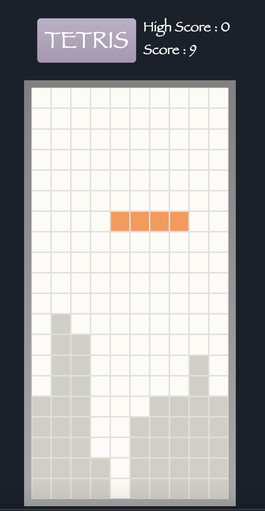
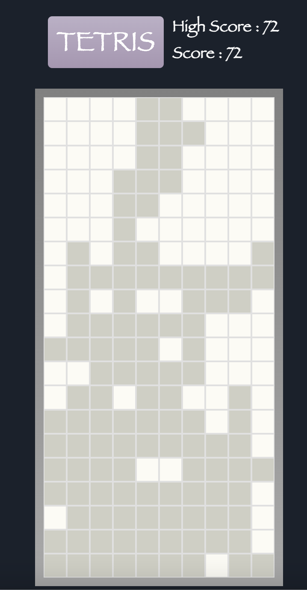

# Tetris
Tetris replica built with Next.js deployed at 
https://tetris-orpin-tau.vercel.app 

## Why?

Inpsired by this coding challenge by John Crickett at 
https://codingchallenges.substack.com/p/coding-challenge-43-tetris

## Technologies
```
- Next.js
- Vercel
```

## Deployment
```
Locally - vercel dev
Deployment - vercel --prod
```

## Gameplay Features
</img>

</img>

## Remaining Items as of 01/2024 
- [x] Timer Bug - Switch to SetTimeout from Set Interval
- [x] Audio start/end on game
- [x] "shifting" board Bug in Chrome
- [x] CSS styling and Visual Effects
- [ ] Leaderboard
- [ ] New Features TBD

